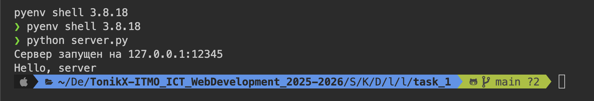
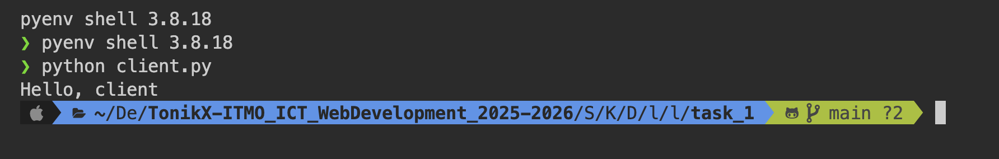

# Задание 1: UDP-клиент и сервер

## Условие

Реализовать клиентскую и серверную часть приложения.  
Клиент отправляет серверу сообщение «Hello, server», и оно должно отобразиться на стороне сервера.  
В ответ сервер отправляет клиенту сообщение «Hello, client», которое должно отобразиться у клиента.

Требования:

- Использовать библиотеку `socket`.
- Реализовать с помощью протокола _UDP_.

---

## Код программы

### Сервер (server.py)

```
import socket

HOST = "127.0.0.1"
PORT = 12345

server_socket = socket.socket(socket.AF_INET, socket.SOCK_DGRAM)
server_socket.bind((HOST, PORT))

print(f"Сервер запущен на {HOST}:{PORT}")

data, addr = server_socket.recvfrom(1024)
print(data.decode())

server_socket.sendto("Hello, client".encode(), addr)
```

### Клиент (client.py)

```
import socket

HOST = "127.0.0.1"
PORT = 12345

client_socket = socket.socket(socket.AF_INET, socket.SOCK_DGRAM)

client_socket.sendto("Hello, server".encode(), (HOST, PORT))

data, _ = client_socket.recvfrom(1024)
print(data.decode())

```

## Запуск

1. Необходимо открыть два терминала.
2. В первом запустите сервер:
   `python server.py`
3. Во втором терминале запустите клиент:
   `python client.py`

## Результат

Cо стороны сервера видим следующее: 

Cо стороны клиента видим: 

Значит, цели задания выполнены.

## Выводы

1. Было реализовано простое взаимодействие между клиентом и сервером через UDP-соединение.
2. Сообщения корректно передаются и отображаются с обеих сторон.
3. Использован минимальный, но достаточный набор функций библиотеки `socket`.
