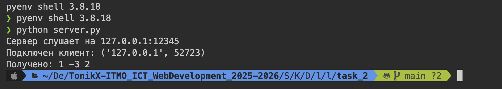
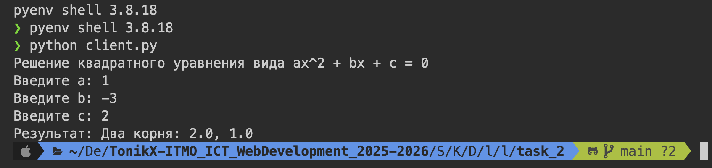

# Задание 2: TCP-клиент и сервер для вычислений

## Условие

Реализовать клиентскую и серверную часть приложения. Клиент запрашивает выполнение математической операции, параметры которой вводятся с клавиатуры. Сервер обрабатывает данные и возвращает результат клиенту.

_Вариант_: 2

_Операция_: Решение квадратного уравнения.

Требования:

- Обязательно использовать библиотеку `socket`.
- Реализовать с помощью протокола TCP.

---

## Код программы

### Сервер (server.py)

```
import socket
import math

HOST = "127.0.0.1"
PORT = 12345


def solve_quadratic(a: float, b: float, c: float) -> str:
    D = b**2 - 4 * a * c
    if D < 0:
        return "Нет действительных корней"
    elif D == 0:
        x = -b / (2 * a)
        return f"Один корень: {x}"
    else:
        x1 = (-b + math.sqrt(D)) / (2 * a)
        x2 = (-b - math.sqrt(D)) / (2 * a)
        return f"Два корня: {x1}, {x2}"


with socket.socket(socket.AF_INET, socket.SOCK_STREAM) as server_socket:
    server_socket.bind((HOST, PORT))
    server_socket.listen(1)
    print(f"Сервер слушает на {HOST}:{PORT}")

    conn, addr = server_socket.accept()
    with conn:
        print(f"Подключен клиент: {addr}")
        data = conn.recv(1024).decode()
        print("Получено:", data)

        parts = data.split()
        a, b, c = float(parts[0]), float(parts[1]), float(parts[2])

        result = solve_quadratic(a, b, c)
        conn.sendall(result.encode())
```

### Клиент (client.py)

```
import socket

HOST = "127.0.0.1"
PORT = 12345

print("Решение квадратного уравнения вида ax^2 + bx + c = 0")

a = input("Введите a: ")
b = input("Введите b: ")
c = input("Введите c: ")

request = f"{a} {b} {c}"

with socket.socket(socket.AF_INET, socket.SOCK_STREAM) as client_socket:
    client_socket.connect((HOST, PORT))
    client_socket.sendall(request.encode())

    data = client_socket.recv(1024).decode()
    print("Результат:", data)
```

## Запуск

1. Необходимо открыть два терминала.
2. В первом запустите сервер:
   `python server.py`
3. Во втором терминале запустите клиент:
   `python client.py`

## Результат

Cо стороны сервера: 

Cо стороны клиента видим: 

## Выводы

1. Реализовано корректное TCP-взаимодействие между клиентом и сервером с использованием библиотеки `socket`.
2. Сервер обрабатывает входные данные и возвращает результат вычислений клиенту.
