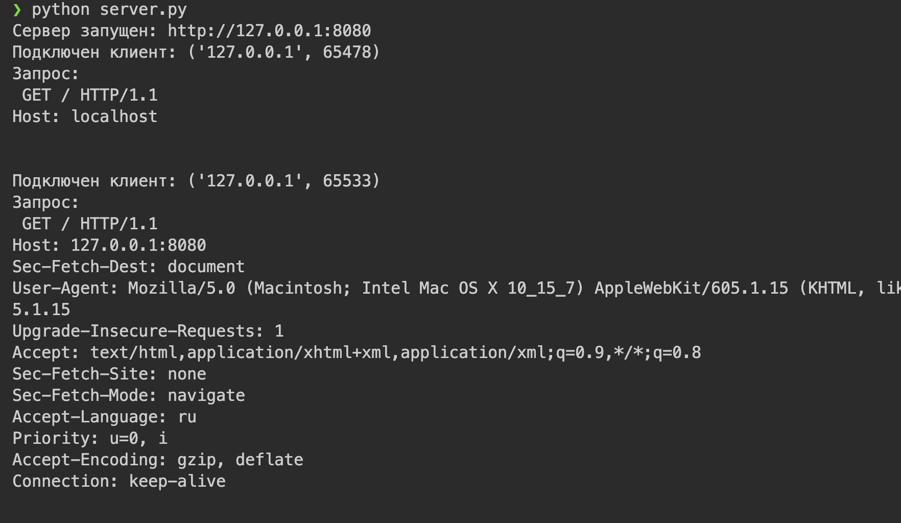
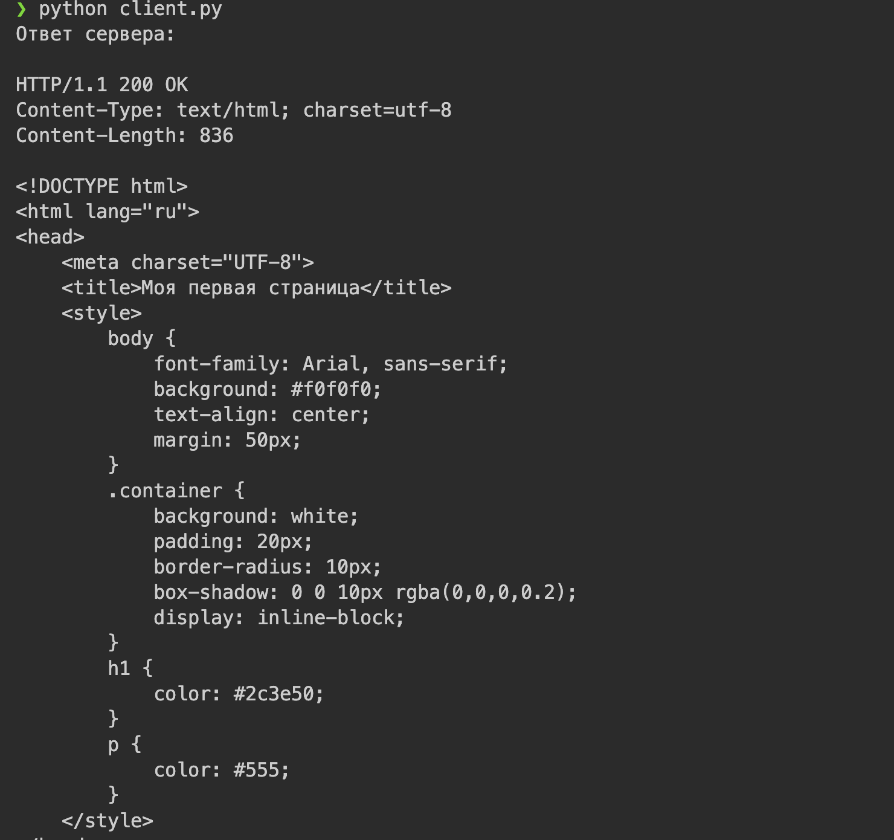

# Задание 3: HTTP-сервер на сокетах

## Условие

Реализовать серверную часть приложения. Клиент подключается к серверу, и в ответ получает HTTP-сообщение, содержащее HTML-страницу, которая сервер подгружает из файла index.html.

Требования:

- Обязательно использовать библиотеку `socket`

## Код программы

### Сервер (server.py)

```
import socket

HOST = "127.0.0.1"
PORT = 8080

with socket.socket(socket.AF_INET, socket.SOCK_STREAM) as server_socket:
    server_socket.bind((HOST, PORT))
    server_socket.listen(1)
    print(f"Сервер запущен: http://{HOST}:{PORT}")

    while True:
        conn, addr = server_socket.accept()
        with conn:
            print(f"Подключен клиент: {addr}")
            request = conn.recv(1024).decode()
            print("Запрос:\n", request)

            try:
                with open("index.html", "r", encoding="utf-8") as f:
                    body = f.read()
            except FileNotFoundError:
                body = "<h1>404 Not Found</h1>"

            response = (
                "HTTP/1.1 200 OK\r\n"
                "Content-Type: text/html; charset=utf-8\r\n"
                f"Content-Length: {len(body.encode('utf-8'))}\r\n"
                "\r\n"
                f"{body}"
            )

            conn.sendall(response.encode("utf-8"))
```

### Клиент (client.py)

```
import socket

HOST = "127.0.0.1"
PORT = 8080

request = "GET / HTTP/1.1\r\nHost: localhost\r\n\r\n"

with socket.socket(socket.AF_INET, socket.SOCK_STREAM) as client_socket:
    client_socket.connect((HOST, PORT))
    client_socket.sendall(request.encode())

    response = client_socket.recv(4096).decode()
    print("Ответ сервера:\n")
    print(response)
```

### HTML-страница (index.html)

```
<!DOCTYPE html>
<html lang="ru">
<head>
    <meta charset="UTF-8">
    <title>Моя первая страница</title>
    <style>
        body {
            font-family: Arial, sans-serif;
            background: #f0f0f0;
            text-align: center;
            margin: 50px;
        }
        .container {
            background: white;
            padding: 20px;
            border-radius: 10px;
            box-shadow: 0 0 10px rgba(0,0,0,0.2);
            display: inline-block;
        }
        h1 {
            color: #2c3e50;
        }
        p {
            color: #555;
        }
    </style>
</head>
<body>
    <div class="container">
        <h1>Привет, мир!</h1>
        <p>Это HTML-страница, отправленная сервером через TCP-сокет.</p>
    </div>
</body>
</html>
```

## Запуск

1. Необходимо открыть два терминала.
2. В первом запустите сервер:
   `python server.py`
3. Во втором терминале запустите клиент:
   `python client.py`
4. Перейдите по ссылке, указанной в терминале.

## Результат

Cо стороны сервера видим следующее: 

Cо стороны клиента видим: 

Переходим по адресу, указанному в терминале: [http://127.0.0.1:8080](http://127.0.0.1:8080)

Видим HTML-страницу, полученную при помощи сервера: 

## Выводы

1. Реализован простой HTTP-сервер с использованием библиотеки socket.

2. Сервер принимает соединения по TCP и отправляет клиенту корректный HTTP-ответ.

3. В качестве содержимого ответа подгружается HTML-страница с минимальным оформлением.

4. Работа позволила понять, как на низком уровне работает взаимодействие клиента и сервера через HTTP.
