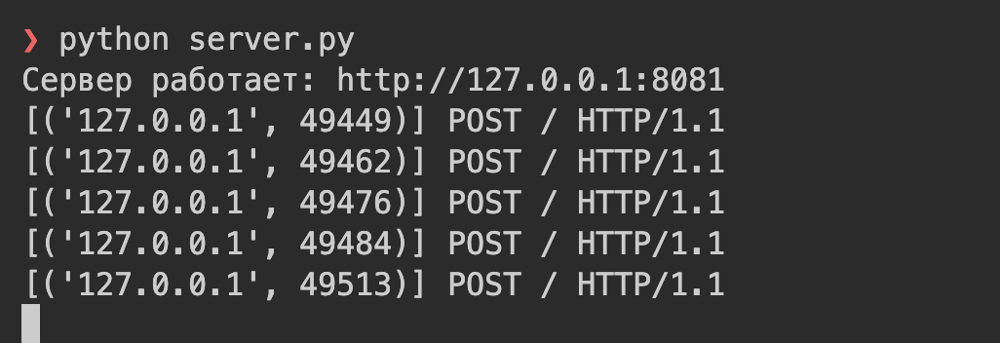
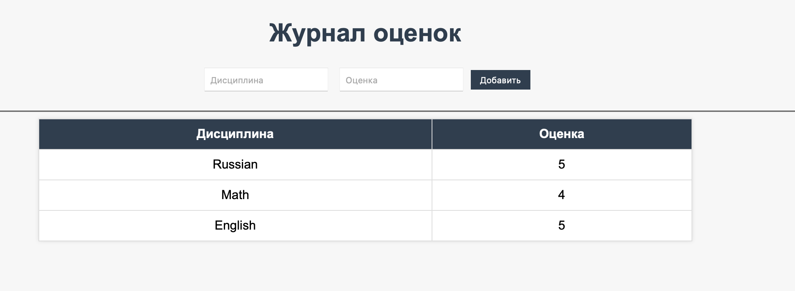

# Задание 5: HTTP-сервер с поддержкой GET и POST-запросов

## Условие

Написать простой веб-сервер для обработки `GET` и `POST` HTTP-запросов с помощью библиотеки `socket` в Python.

Сервер должен:

- Принять и записать информацию о дисциплине и оценке по дисциплине.
- Отдать информацию обо всех оценках по дисциплинам в виде HTML-страницы.

## Код программы

### Сервер (server.py)

```
import socket
from urllib.parse import unquote, parse_qs

HOST = "127.0.0.1"
PORT = 8081

grades = []


def build_html():
    html = """
    <!DOCTYPE html>
    <html lang="ru">
    <head>
        <meta charset="UTF-8">
        <title>Журнал оценок</title>
        <style>
            body {
                font-family: Arial, sans-serif;
                background: #f7f7f7;
                margin: 40px;
            }
            h1 {
                text-align: center;
                color: #2c3e50;
            }
            form {
                text-align: center;
                margin-bottom: 20px;
            }
            input[type="text"] {
                padding: 6px;
                margin: 5px;
            }
            input[type="submit"] {
                padding: 6px 12px;
                background: #2c3e50;
                color: white;
                border: none;
                cursor: pointer;
            }
            input[type="submit"]:hover {
                background: #34495e;
            }
            table {
                width: 60%;
                margin: 0 auto;
                border-collapse: collapse;
                background: #fff;
                box-shadow: 0 0 5px rgba(0,0,0,0.1);
            }
            th, td {
                border: 1px solid #ddd;
                padding: 10px;
                text-align: center;
            }
            th {
                background: #2c3e50;
                color: #fff;
            }
        </style>
    </head>
    <body>
        <h1>Журнал оценок</h1>
        <form method="POST" action="/">
            <input type="text" name="discipline" placeholder="Дисциплина" required>
            <input type="text" name="grade" placeholder="Оценка" required>
            <input type="submit" value="Добавить">
        </form>
        <hr>
    """

    if grades:
        html += "<table><tr><th>Дисциплина</th><th>Оценка</th></tr>"
        for g in grades:
            html += f"<tr><td>{g['discipline']}</td><td>{g['grade']}</td></tr>"
        html += "</table>"
    else:
        html += "<p style='text-align:center;'>Пока нет данных.</p>"

    html += "</body></html>"
    return html


def handle_request(request_text: str):
    lines = request_text.split("\r\n")
    if not lines:
        return "HTTP/1.1 400 Bad Request\r\n\r\n"

    request_line = lines[0]
    method, path, _ = request_line.split()

    body = ""
    if "" in lines:
        body = "\r\n".join(lines[lines.index("") + 1 :])

    if method == "POST" and path == "/":
        params = parse_qs(body)
        discipline = unquote(params.get("discipline", [""])[0])
        grade = unquote(params.get("grade", [""])[0])
        if discipline and grade:
            grades.append({"discipline": discipline, "grade": grade})

    html = build_html()
    response = (
        "HTTP/1.1 200 OK\r\n"
        "Content-Type: text/html; charset=utf-8\r\n"
        f"Content-Length: {len(html.encode('utf-8'))}\r\n"
        "\r\n"
        f"{html}"
    )
    return response


def main():
    with socket.socket(socket.AF_INET, socket.SOCK_STREAM) as server:
        server.setsockopt(socket.SOL_SOCKET, socket.SO_REUSEADDR, 1)
        server.bind((HOST, PORT))
        server.listen(5)
        print(f"Сервер работает: http://{HOST}:{PORT}")
        while True:
            conn, addr = server.accept()
            with conn:
                data = conn.recv(4096).decode("utf-8")
                if not data:
                    continue
                print(f"[{addr}] {data.splitlines()[0]}")
                response = handle_request(data)
                conn.sendall(response.encode("utf-8"))


if __name__ == "__main__":
    main()
```

## Запуск

1. Необходимо открыть терминал.
2. В терминале запустите сервер `python server.py`:
3. Откройте браузер и перейдите по адресу: http://127.0.0.1:8081
4. Добавьте дисциплины и оценки через форму.

## Результат

- Запустив сервер, видим: 

- При заходе на / отображается таблица с текущими дисциплинами и оценками.

- При отправке формы (POST /) данные сохраняются в память и появляются в таблице.

- Таблица обновляется динамически, без перезапуска сервера: 

## Выводы

1. Реализован HTTP-сервер на socket и TCP с поддержкой GET и POST.

2. Сервер принимает данные о дисциплинах и оценках и сохраняет их в памяти.

3. HTML-страница отображает таблицу с оценками и форму для добавления новых записей.

4. Задание позволило изучить принципы работы HTTP без использования фреймворков и внешних библиотек.
